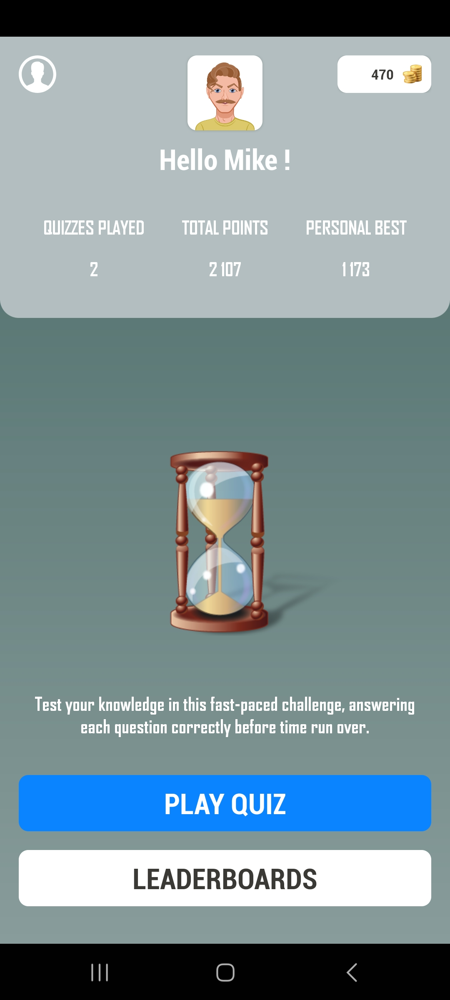

# InQuizitive

InQuizitive is an engaging and interactive quiz game application built with Kotlin for Android, using the MVVM architecture. The game challenges players with random questions from various categories and difficulty levels, retrieved from [The Trivia API](https://the-trivia-api.com/v2/questions/). Players can track their progress, compete for high scores, and utilize in-game help cards to improve their chances of winning.

## Features

- **Random Questions**: Retrieve 10 random questions from a variety of categories:
  - Music
  - Sport and Leisure
  - Film and TV
  - Arts and Literature
  - History
  - Society and Culture
  - Science
  - Geography
  - Food and Drink
  - General Knowledge

- **Difficulty Levels**: Questions are classified into three difficulty levels:
  - Easy: 20 seconds per question
  - Medium: 30 seconds per question
  - Hard: 40 seconds per question

- **Scoring and Coins**: 
  - Points and coins are awarded based on the difficulty level of each question.
  - Coins can be used to purchase help cards, which remove incorrect answers, making it easier to answer correctly.

- **Time Alerts**: 
  - When the timer reaches 10 seconds or less, the background color changes to red and a ticking sound is played, warning the player that time is running out.

- **Feedback Sounds**: 
  - Upon revealing the correct answer, a success or error sound is played depending on the player's response.

- **Results Screen**: 
  - After completing 10 questions, a results screen displays the player's score and whether they set a new high score. Players can choose to play another quiz or return to the Home screen.

- **Leaderboard**: 
  - View the leaderboard showing the top scores and corresponding usernames. The highest score is highlighted, along with the user's avatar.

- **User Profiles**: 
  - Players must register with a username, password, and select an avatar (male or female) to play the quiz.
  - Once logged in, users can track their game progress, including points, best scores, time spent, correct answers, accuracy percentage, time usage percentage, coins earned, and coins spent.
  - Users can also change their avatar from the profile screen.

- **Internet Connectivity Check**: 
  - The app checks for internet connectivity at startup. If no connection is detected, a message prompts the user to connect to a Wi-Fi network.

## Installation

1. Clone this repository to your local machine.
   ```bash
   git clone https://github.com/yourusername/InQuizitive.git
   ```
2. Open the project in Android Studio.
3. Build and run the app on an Android device or emulator.

## Requirements

- Android 5.0 (Lollipop) or higher.
- Internet connection to fetch questions from the API.

## Usage

1. Register with a username, password, and select your avatar.
2. Answer the questions within the time limit, using help cards if necessary.
3. View your results and see if you set a new high score.
4. Check the leaderboard to see where you rank among other players.
5. Monitor your progress and achievements in the user profile section.

## Screenshots

<div align="center">
    
    
    
    <br><br>
    
    
    
    <br><br>
    
    
    
    <br><br>
    
    
    
    <br><br>
    
    
</div>

## Acknowledgments

- [The Trivia API](https://the-trivia-api.com/) for providing the questions.
- [Kotlin](https://kotlinlang.org/) for the programming language.
- [Android Studio](https://developer.android.com/studio) for the development environment.
